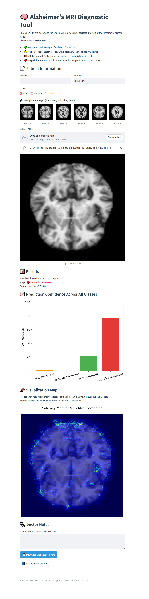

# 🧠 Alzheimer MRI Detection
**Version 1.1 (lite): Streamlit-only, stateless (2026)**  
Original full-stack version (FastAPI + DB) was v1.0

An end-to-end deep learning project for classifying Alzheimer’s disease stages from brain MRI scans using a custom CNN model, with an interactive Streamlit web app and PDF report export.

**🌐 Live Demo**: [https://asma-b-alzheimer-mri-detection.streamlit.app](https://asma-b-alzheimer-mri-detection.streamlit.app)


## 🏗️ Project Flow

| 📂 Data| ➡️ | 🔧 Preprocessing | ➡️ | 🧠 Model Training | ➡️ | 📊 Evaluation| ➡️ | ⚡ Serving| ➡️ | 🐳 Deployment|
|--------|----|------------|----|------------|----|-----------|----|--------|----|-----|
| MRI images (4 classes)   | ➡️ | Resizing to 128×128, grayscale → RGB, normalization | ➡️ | Custom CNN, EfficientNetB0, DenseNet121, ResNet50 | ➡️ | Accuracy, Loss, Macro F1, MCC, per-class metrics | ➡️ | Streamlit UI  | ➡️ | Docker |


## 🎯 Project Overview

- **Task**: Classify MRI scans into four Alzheimer’s stages: Non Demented, Very Mild Demented, Mild Demented, Moderate Demented.
- **Deployed model**: Custom CNN (98.33% test accuracy)
- **Frontend**: Streamlit app for image upload, prediction, confidence visualization, saliency maps for interpretability, and downloadable PDF summary report
- **Interpretability**: Saliency maps to show which brain regions influenced the prediction
<details>
<summary>App Screenshot (click to view)</summary>

**Streamlit interface**: image upload, prediction, confidence chart, saliency map, and PDF report export  


</details>

## 📊 Model Comparison

| Model              | Test Accuracy | Test Loss | Macro F1 | MCC    |
|--------------------|---------------|-----------|----------|--------|
| **ResNet50 (baseline)**| 98.75%        | 0.0453    | 0.9793   | 0.9794 |
| **DenseNet121**        | 96.56%        | 0.1293    | 0.9602   | 0.9432 |
| **EfficientNetB0**     | 91.87%        | 0.2442    | 0.9093   | 0.8653 |
| **🏆 Custom CNN** | **98.33%**    | **0.0676** | **0.9848** | **0.9725** |

> **Full training details** (curves, per-class recall/precision/F1, confusion matrice, ROC curves, best epochs, etc.) are available in the Jupyter notebook → [`notebook/`](./notebook)

## 📦 Installation

1. **Download Dataset**:
   - Get from: [Alzheimer MRI Preprocessed Dataset](https://www.kaggle.com/datasets/sachinkumar413/alzheimer-mri-dataset)
   - After downloading and extracting the archive (which may be named `archive.zip`), locate the folder named `Dataset`. Inside it, you will find the `Mild_Demented/`, `Moderate_Demented/`, `Non_Demented/`, and `Very_Mild_Demented/` directories.

    - Copy or move these folders directly into the `data/dataset/` directory of this repository.

    Your project directory structure should be like:

    ```
    data/
    ├── dataset/
    │   ├── Mild_Demented/
    │   ├── Moderate_Demented/
    │   ├── Non_Demented/
    │   └── Very_Mild_Demented/

    ```
2. **Run Options**:

    **Option A: Local**
    - Create and activate a virtual environment:
      ```bash
      # On macOS/Linux
      python3.10 -m venv .venv
      source .venv/bin/activate

      # On Windows
      py -3.10 -m venv .venv
      .venv\Scripts\activate
      ```
    - Install dependencies:
      ```bash
      pip install -r requirements.txt --default-timeout=1000
      ```
    - Run the streamlit app:
      ```bash
      streamlit run app.py
      ```

    **Option B: Docker**
    - Build and run:
      ```bash
      # Build the image
      docker build -t alzheimer-mri .

      # Run it
      docker run -p 8501:8501 alzheimer-mri
      ```

>  Open browser at: [http://localhost:8501](http://localhost:8501)

## 📜 Attribution & License

### Dataset
This project uses the [Alzheimer MRI Preprocessed Dataset](https://www.kaggle.com/datasets/sachinkumar413/alzheimer-mri-dataset) from Kaggle, licensed under the [CC BY-NC-SA 4.0](https://creativecommons.org/licenses/by-nc-sa/4.0/). Attribution: Dataset by Sachin Kumar.

### Project License
This project is licensed under the MIT License. See the [LICENSE](LICENSE) file for details.

## 📚 References

- [Streamlit Docs](https://docs.streamlit.io/)
- [TensorFlow Docs](https://www.tensorflow.org/)
- [Docker Python Guide](https://docs.docker.com/language/python/)

## ⚠️ Ethical & Dataset Disclaimer

This is **not** a medical device and does **not** replace professional diagnosis.  
Use only for **educational and portfolio purposes**.

Dataset limitations: no patient-level split (risk of leakage), limited diversity, no metadata.  
Accuracies likely inflated vs real clinical settings. 
This is an **educational engineering and deployment demonstration**, not clinical research.

